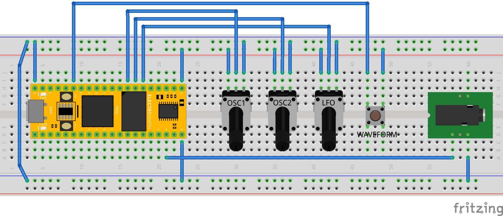

# DaisyDrone

Basic Drone Synth based on [Daisy Seed from Electro Smith](https://www.electro-smith.com/daisy/daisy).
See the [DaisyWiki](https://github.com/electro-smith/DaisyWiki/wiki) to setup the build environment

# Schematics



# Build

```
$ ./build_deps.sh # to build the daisy libs
$ ./build.sh # to build the app
```

Output files in `src/build`
